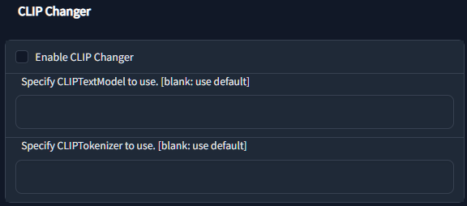
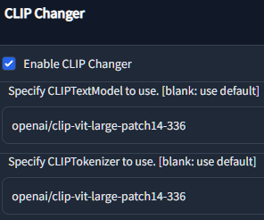

# CLIP changer



[日本語READMEはこちら](README.ja.md)

- This is Extension for [AUTOMATIC1111's Stable Diffusion Web UI](https://github.com/AUTOMATIC1111/stable-diffusion-webui)
- Add feature to change CLIPTextModel and CLIPTokenizer

## How to install

- Open `Extensions` on webui

- `Install from URL` 

- `Install` 

## How to use

- Open "settings"
- Input CLIP address for your needs

## Note

This extension will exchange CLIP at "after model Loaded".

It means,

- no change applied until model re-loaded if you change setting

- also no change applied until model re-loaded if you Disable this extension

You should care about which CLIP is now applied.

This function may cause problem with model merge / training.

## Settings


| In "Setting" tab              | Sample                        |
| ----------------------------- | ----------------------------- |
| Enable CLIP Changer           |                               |
| Specify CLIPTextModel to use. | openai/clip-vit-large-patch14 |
| Specify CLIPTokenizer to use. | openai/clip-vit-large-patch14 |

Supported CLIPTextModel, CLIPTokenizer is diffusers

```python
from transformers import CLIPTextModel, CLIPTokenizer
```

## Sample of settings

- Run test with, 
  
   - `openai/clip-vit-large-patch14`
   - `openai/clip-vit-large-patch14-336`

- sample image



## Special Thanks

- [「[WebUI] Stable DiffusionベースモデルのCLIPの重みを良いやつに変更する」](https://zenn.dev/discus0434/articles/7ada798c5cc87d)
